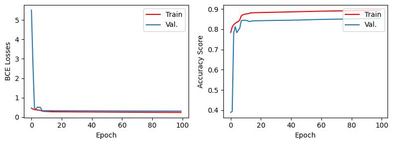
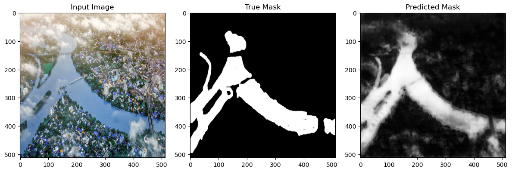
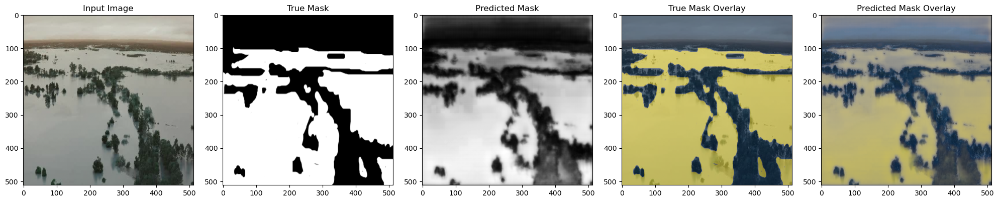
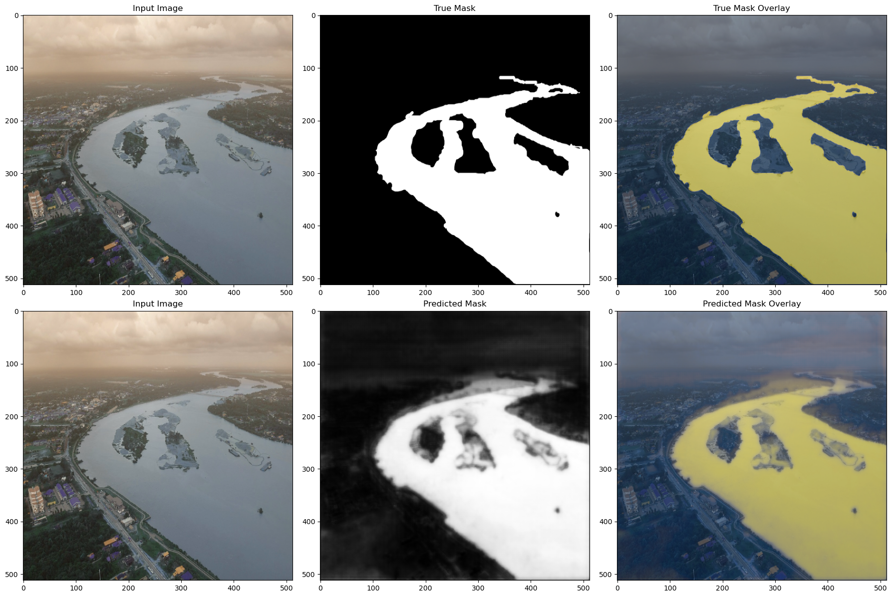

# Flood Area Segmentation by U-Net

This project implements a flood area segmentation model using the U-Net architecture. The U-Net architecture is widely used for image segmentation tasks due to its ability to capture intricate spatial features.

## Table of Contents
- [Introduction](#introduction)
- [Model Architecture](#model-architecture)
- [Training](#training)
- [Predicting and Evaluation](#predicting-and-evaluation)
- [Results](#results)
- [Dataset Link](#dataset-link)
- [References](#references)

## Introduction

This project focuses on segmenting flood areas within images using a U-Net neural network architecture. The U-Net architecture is known for its symmetric structure that includes an encoding path (contracting path) and a decoding path (expansive path). It's particularly suited for image segmentation tasks where pixel-level accuracy is required.

## Model Architecture

The U-Net architecture is implemented in the code. It consists of an encoding path, a bridge, and a decoding path. The encoding path extracts features from the input image, the bridge connects the encoding and decoding paths, and the decoding path generates the segmented output.

## Training

The model is trained using the provided dataset. Training parameters such as batch size, learning rate, and number of epochs can be adjusted at the beginning of the code. After training, the best model is saved, and training history is logged in a CSV file.

## Predicting and Evaluation

After training the model, you can use it to predict flood area segments in new images. The code snippet provided demonstrates how to visualize predictions and evaluate the model's performance on a subset of validation data. The following metrics are used for evaluation:

- **BCE Losses**: Binary Cross-Entropy loss, computed during training and validation.
- **Accuracy Score**: Accuracy of the model on training and validation data.
- **Intersection over Union (IoU)**: A common metric for evaluating segmentation models.

## Results

The trained model can be evaluated on new images to predict flood area segments. To visualize the results, you can use the model's predictions and overlay them on the original images. 

After training the U-Net model on the flood area segmentation dataset, here are the evaluation scores for the final epoch:

- **Loss**: 0.2415
- **Accuracy**: 0.8945

Additionally, the validation scores for the same epoch are as follows:

- **Validation Loss**: 0.3098
- **Validation Accuracy**: 0.8537

The model's progress is also illustrated in the training history graphs for both loss and accuracy. The loss steadily decreases over epochs, while the accuracy shows improvement as well. However, it's important to monitor validation metrics to ensure that the model doesn't overfit.

## Training History and Sample Predictions

Here's a visualization of the training history showing the changes in loss and accuracy over epochs:

Next, let's visualize some sample predictions made by the trained model:

In these sample predictions, the first image is the input image, the second image is the true mask, and the third image is the predicted mask from the model. As shown, the model is able to accurately identify and segment flood areas in the input images.

## Dataset Link

You can access the dataset used in this project from the following link:

[Dataset Link](https://www.kaggle.com/datasets/faizalkarim/flood-area-segmentation)

## References

- U-Net: Convolutional Networks for Biomedical Image Segmentation. Olaf Ronneberger, Philipp Fischer, Thomas Brox. [Paper Link](https://arxiv.org/abs/1505.04597)
